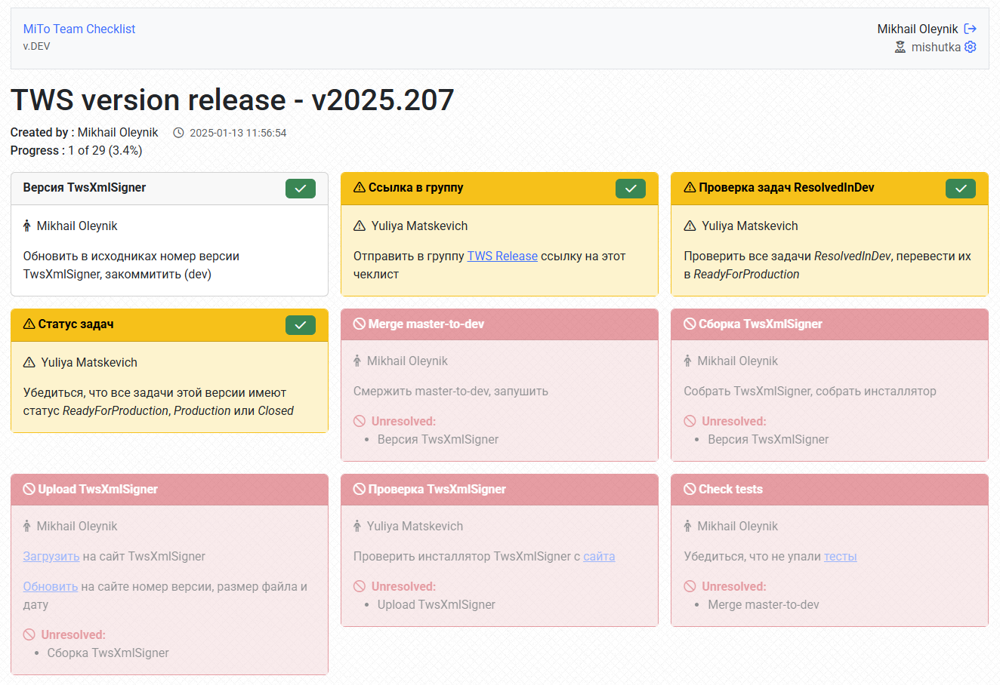

# mt-checklist

[MiTo Team](https://www.mito-team.com) Checklists Manager

Project Status: **BETA-version**, **Active Development**

## About

Simple **self-hosted** checklists manager. Only you own your data.

## How to try

* Download latest version for your platform and unpack it (single executable file).
* Run `mt-checklist init` to create default settings file.
* Open `.settings.yml` and adjust options if you need.
* Run `mt-checklist run`. It will print address to open browser in console. Program will create database file `data.db` in same folder.

You can use `mt-checklist install` under Linux to install it as a daemon.

## Upgrade

* Download new version.
* Stop program or daemon.
* Replace executable with newer version.
* Start it again (it will perform all upgrades automatically).

## Interested?

[Let us know](mailto:checklist@mito-team.com)! It is a good motivation to improve project.

Have requests or ideas? Share it by [creating](https://github.com/mitoteam/mt-checklist/issues/new/choose) an issue.

## Development Dependencies

* [mitoteam/mttools](https://github.com/mitoteam/mttools)
* [mitoteam/dhtml](https://github.com/mitoteam/dhtml)
* [mitoteam/dhtmlform](https://github.com/mitoteam/dhtmlform)
* [mitoteam/dhtmlbs](https://github.com/mitoteam/dhtmlbs)
* [mitoteam/mbr](https://github.com/mitoteam/mbr)

* [mitoteam/goapp](https://github.com/mitoteam/goapp)
* [mitoteam/mtweb](https://github.com/mitoteam/mtweb)
